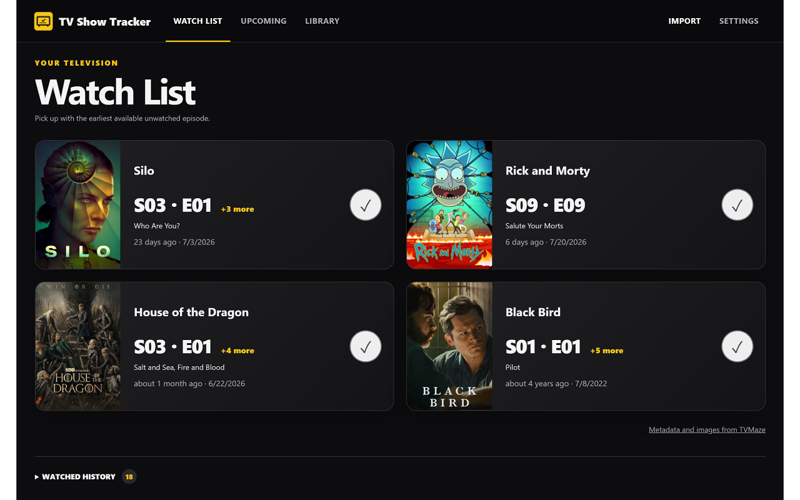
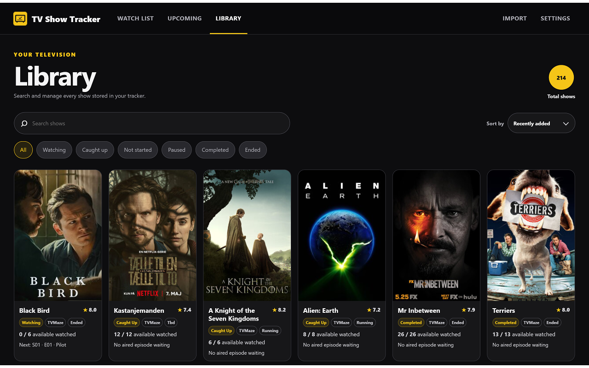
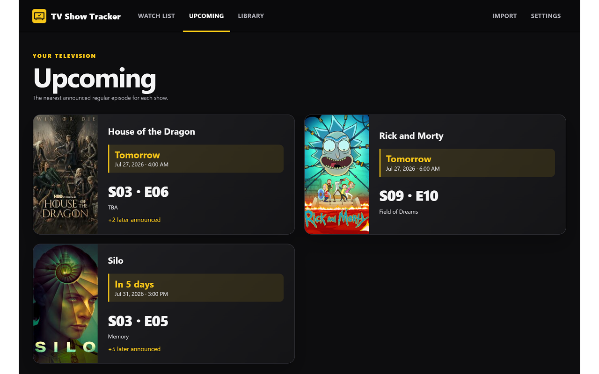

# Show Tracker

Keep track of your TV shows, the episodes you have watched, and what is coming next in Chrome or Firefox. Import your IMDb lists, TV Time history, Refract or Bingers export, or add shows yourself.

## Screenshots

Library and upcoming episodes

Screenshots show example library progress and schedules captured at the time.

## Install in Chrome

### 1. Download the extension

1. Open the [Downloads / Releases page](https://github.com/ClaudiuG98/show-tracker/releases).
2. Open the newest release and find **Assets** beneath its description. Click **Assets** if the list is collapsed.
3. Download the **Chrome extension ZIP** listed there — look for a filename containing `chrome` and ending in `.zip`.

**Do not choose “Source code (zip)” or the green “Code → Download ZIP” button.** Those download the programming files, not the ready-to-install extension.

### 2. Extract the ZIP into a permanent folder

A ZIP is a compressed folder. You need to extract its contents before Chrome can use them.

**Keep this extracted folder after installation.** Chrome loads the extension from it, so moving or deleting it can stop the extension working. You can delete the downloaded ZIP after extracting it.

### 3. Add it to Chrome

1. Open Chrome.
2. Copy `chrome://extensions` into the **address bar at the top**, then press Enter. Do not put it into a Google search box.
3. Turn on **Developer mode**, usually in the top-right corner. This lets Chrome load an extension from a folder; you do not need to write any code.
4. Click **Load unpacked**.
5. Select the extracted folder that contains **`manifest.json`**, then click **Select Folder** or **Open**.
6. A **Show Tracker** card should appear. Make sure its switch is on.

Only install extension files from a source you trust. On a work or school computer, your administrator may block manual installations; do not bypass those restrictions.

### 4. Pin it beside the address bar

1. Click Chrome's **puzzle-piece icon** near the top-right corner.
2. Find **Show Tracker**.
3. Click the **pin** beside it.
4. Click the pinned tracker icon to open your dashboard.

**Pinning matters:** new-episode alerts appear on this icon, not as Windows or desktop notifications. You can try an alert from **Settings → New episode alerts → Preview the alert**.

## Install in Firefox

Firefox desktop **140 or newer** is supported. Download the **Mozilla-signed Firefox `.xpi`** from the [Releases page](https://github.com/ClaudiuG98/show-tracker/releases), open `about:addons`, and choose the gear menu → **Install Add-on From File…**. Select the `.xpi` and approve the permissions, then pin Show Tracker to the toolbar for episode alerts.

No Developer Mode or permanent extracted folder is needed. If the release only has an unsigned Firefox ZIP, it is not ready for normal installation yet: the maintainer must have Mozilla sign it first. Renaming a ZIP to `.xpi` does not sign it.

Firefox supports the same imports, watched history, episode alerts, and Downloads backups. Custom backup folders are unavailable because Firefox does not expose the required folder-picker API. Chrome and Firefox keep separate libraries; use a JSON backup to transfer progress.

Firefox's installation disclosure covers show search terms and show information sent to TVMaze for matching and metadata. Your imported files, episode watch dates, and watch history are not uploaded. There is no developer backend or analytics.

## Add your shows

The first time you open the tracker, it takes you to **Import**.

- **IMDb:** choose your exported list `.csv` file.
- **TV Time:** choose your exported `.zip` archive, including the official GDPR export.
- **Refract:** choose your exported `.zip` archive.
- **Bingers:** choose your exported `.zip` archive containing `library.csv` and `watches.csv`. Shows, watch dates, and repeat watches are supported; movies, custom lists, and episode ratings are not imported.

Keep TV Time, Refract, and Bingers export ZIPs zipped — unlike the extension installation ZIP, these are read directly by the importer. The Import page also explains where to get your exports.

After choosing your files, let the tracker match your shows and load their episodes. A large library can take several minutes. Review any questions or matching decisions, then click **Import … shows** to finish. An IMDb list alone does not contain your full episode-watching history, so you may need to set that progress yourself.

You do not have to import anything: open **Library → + Add show** to search for a show and add it manually.

## Using the tracker

- **Watch List:** the next available unwatched episode for each show. Mark it watched when you finish.
- **Upcoming:** the next announced releases.
- **Library:** all your tracked shows. Open a show to see its seasons and manage your progress.
- **Watched history:** actions stacked by show, with the most recently changed show first. Expand a show for individual actions and Undo, or use **Load more** for more shows. Episode counts are unique episodes marked watched in saved history, not your all-time watched total.
- **Settings:** episode alerts, metadata checks, and backups.

Show and episode information is checked automatically once a day while your browser is running. You can also use **Settings → Check for updates**. Internet access is needed to search, import show metadata, and refresh schedules; previously saved progress stays in your browser.

## Back up your progress

For automatic backups, open **Settings → Backup and restore → Automatic backups** and choose Daily, Weekly, or Monthly. In Firefox, click **Apply schedule** to confirm. This is off by default; weekly is recommended. The first backup runs when enabled, then only changed data is saved. If your browser is closed when a backup is due, it runs when the browser next starts.

Backups go to **Show Tracker Backups** inside your browser's Downloads folder, with your permission. In browsers that support it, use **Choose folder…** for another location, preferably a dedicated folder outside the extension installation folder. If folder access expires, use **Reconnect folder**. The latest five automatic backups are kept per location; older automatic files are removed only after a new backup succeeds. Manual exports are not removed. Settings shows the last successful backup and any errors; **Back up now** lets you test it.

Backup schedules and folder permissions are specific to this browser and are not restored from exported files. Removing all tracker data turns automatic backups off but leaves existing backup files on disk.

Custom folder selection requires the browser's File System Access API. Firefox does not support it and Brave disables it by default; automatic backups to Downloads still work. If folder selection is unavailable, Settings explains this beside the disabled **Choose folder…** button.

**Your library does not automatically sync to another browser, profile, or computer.**

1. Open the tracker and choose **Settings**.
2. Under **Backup and restore**, click **Export JSON backup**.
3. Save the downloaded `.json` file somewhere safe. It contains your shows, progress, history, and settings.

To restore it, use **Settings → Choose backup to restore**, select the file, and review the confirmation before applying it. You can also select a tracker backup on the Import page.

Make backups periodically, especially before uninstalling the extension, deleting a browser profile, or changing computers. **Removing the extension can erase its saved data.** Treat backup and import files as personal files; do not upload them to a public GitHub issue.

## If something does not work

| Problem | What to do |
| --- | --- |
| “Manifest file is missing or unreadable” | Extract the installation ZIP first, then select the folder containing `manifest.json`, not the ZIP or its parent folder. Check that you downloaded the Chrome release asset, not the source code. |
| No download under Assets | If only source-code archives are listed, there is no ready-made build available yet. |
| The icon is missing | Open the puzzle-piece menu and pin Show Tracker. In Chrome, check that it is enabled at `chrome://extensions`; in Firefox, check `about:addons`. |
| No desktop notification appears | This is expected. Alerts use the pinned toolbar icon. Check the alert toggle and try **Preview the alert** in Settings. |
| Import seems slow | Large imports look up many shows. Stay connected and let it finish; repeated restarts can make it take longer. |
| Episode details seem outdated | Try **Settings → Check for updates**. If information is still missing, use **Settings → Troubleshooting → Re-download all metadata**. This keeps your watched progress. TVMaze must have the correct information for it to appear here. |
| The extension stopped loading after moving files | Chrome needs the original extracted folder. Put it back in its original location and use the reload button on the extension's card at `chrome://extensions`. |

## Maintenance and updates

This is a personal project shared as-is. Regular feature updates are not planned. **That does not stop episode schedules from refreshing through TVMaze.** However, future changes to Chrome, IMDb, or TVMaze could require a fix; continued compatibility is not guaranteed.

GitHub downloads do not automatically install new extension versions. If a replacement release is ever provided, export a backup first, replace the extension files in the **same installation folder**, then click the extension's reload button at `chrome://extensions` and refresh the dashboard. Do not uninstall it just to update it.

For Firefox, install the newer signed `.xpi` over the existing extension without uninstalling it. Releases must keep the same add-on ID to preserve the library.
